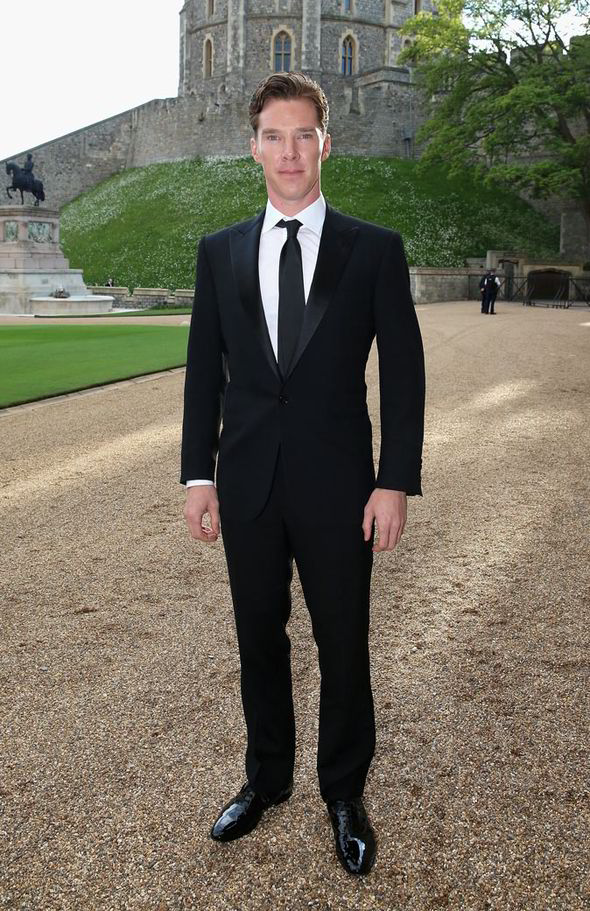
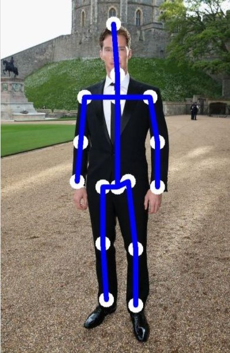

# Monocular Human Pose Estimation and ONNX Models

This project had one objectives i.e.

- Deploy a pre-trained model to predict the Monocular Human Pose in an image.

## Code Setup

To run the pose estimation script follow the steps below:

- Install requirements  
  `pip install -r requirements.txt`
- Download the pre-trained pose estimation model (`pose_resnet_50_256x256.pth.tar`) from [here](https://drive.google.com/drive/folders/1g_6Hv33FG6rYRVLXx1SZaaHj871THrRW) and move it to the _models_ directory.
- Run the pose estimation script  
  `python3 pose_estimation.py --image <path to image>`

To convert the model to **ONNX**, use the `--convert` flag, it will save the model in the onnx format.  
`python3 pose_estimation.py --image <path to image> --convert`

### Results

The model deployed on AWS Lambda gave the following results

|                             Input Image                             |                             Output Image                             |
| :-----------------------------------------------------------------: | :------------------------------------------------------------------: |
|  |  |

 
